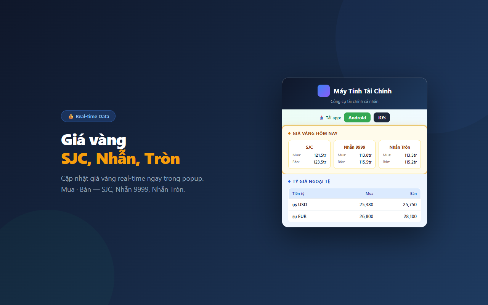

# 🏗 Máy Tính Tài Chính — Free Financial Calculators for Vietnam

  

  
  
  
  

> **Nền tảng quản lý tài chính cá nhân miễn phí hàng đầu Việt Nam.** 20+ công cụ tính toán tài chính chính xác theo luật thuế 2026 (biểu thuế 5 bậc mới), cập nhật lãi suất ngân hàng, và hướng dẫn đầu tư cho người Việt.

🔗 **Website:** [maytinhtaichinh.com](https://maytinhtaichinh.com) | [thaptaisan.com](https://thaptaisan.com)

---

## 📥 Tải Ứng Dụng

  
  &nbsp;&nbsp;&nbsp;
  

| Nền tảng | Link tải |
|:---------|:---------|
| 🍎 **iOS (App Store)** | [50+ Máy Tính Tài Chính](https://apps.apple.com/vn/app/50-máy-tính-tài-chính/id6759550075?l=vi) |
| 🤖 **Android (Google Play)** | [Tháp Tài Sản](https://play.google.com/store/apps/details?id=com.thaptaisan.mobile&pcampaignid=web_share) |
| 🌐 **Chrome Extension** | [Cài đặt Extension](https://chromewebstore.google.com/detail/elkcnfiekdidhhinbkkonjadkcbfodlm) |
| 💻 **Web App** | [maytinhtaichinh.com](https://maytinhtaichinh.com) |

---

## 📱 Mobile App — Tháp Tài Sản (Flutter)

Ứng dụng di động **Tháp Tài Sản** — quản lý tài sản cá nhân toàn diện:

- 📊 **Quản lý danh mục đầu tư** — Theo dõi cổ phiếu, quỹ ETF, vàng, crypto, bất động sản
- 💰 **Theo dõi tài sản ròng** — Biểu đồ tăng trưởng tài sản theo thời gian
- 📈 **P/L Calculator** — Tính lãi/lỗ cho từng loại tài sản
- 🏦 **Liên kết tài khoản** — Tiết kiệm, cổ phiếu, crypto trong 1 app
- 🌙 **Dark mode** — Giao diện tối hiện đại

---

## 🔌 Chrome Extension — Giá Vàng & Tỷ Giá

  

Theo dõi **giá vàng SJC, 9999** và **tỷ giá USD** real-time ngay trên Chrome toolbar.

👉 [**Cài đặt Chrome Extension →**](https://chromewebstore.google.com/detail/elkcnfiekdidhhinbkkonjadkcbfodlm)

---

## 🧮 Công Cụ Tính Toán (20+ Calculators)

Tất cả công cụ **miễn phí**, không cần đăng ký, cập nhật theo quy định 2026.

| Công cụ | Mô tả | Link |
|:--------|:------|:-----|
| **Thuế TNCN 2026** | Tính thuế thu nhập cá nhân theo biểu thuế 5 bậc mới | [Dùng ngay →](https://maytinhtaichinh.com/cong-cu/tinh-thue-thu-nhap-ca-nhan) |
| **Lương Gross ↔ Net** | Quy đổi lương Gross sang Net và ngược lại | [Dùng ngay →](https://maytinhtaichinh.com/cong-cu/tinh-luong-gross-net) |
| **Lãi Vay Mua Nhà** | Tính lãi vay ngân hàng trả góp mua nhà/căn hộ | [Dùng ngay →](https://maytinhtaichinh.com/cong-cu/so-sanh-mua-nha-vs-thue-nha) |
| **Lãi Vay Mua Xe** | Tính chi phí trả góp mua ô tô/xe máy | [Dùng ngay →](https://maytinhtaichinh.com/cong-cu/tinh-tien-vay-mua-xe) |
| **FIRE Calculator** | Tính số năm để nghỉ hưu sớm (FIRE Number) | [Dùng ngay →](https://maytinhtaichinh.com/cong-cu/tinh-fire-nghi-huu-som) |
| **DCA Calculator** | Mô phỏng đầu tư định kỳ | [Dùng ngay →](https://maytinhtaichinh.com/cong-cu/tinh-dau-tu-dinh-ky-dca) |
| **Quỹ Dự Phòng** | Tính quỹ khẩn cấp 3-6 tháng chi phí | [Dùng ngay →](https://maytinhtaichinh.com/cong-cu/tinh-quy-du-phong) |
| **Quy Đổi Ngoại Tệ** | Quy đổi USD, EUR, JPY sang VND | [Dùng ngay →](https://maytinhtaichinh.com/cong-cu/currency-calculator) |
| **Giá Vàng** | Theo dõi giá vàng SJC, 9999 real-time | [Dùng ngay →](https://maytinhtaichinh.com/cong-cu/gia-vang) |
| **Tỷ Suất Nợ DTI** | Đánh giá khả năng vay vốn | [Dùng ngay →](https://maytinhtaichinh.com/cong-cu/tinh-ty-le-no-an-toan) |
| **Sức Khỏe Tài Chính** | Đánh giá toàn diện tình hình tài chính | [Dùng ngay →](https://maytinhtaichinh.com/cong-cu/diem-suc-khoe-tai-chinh) |
| **Lợi Nhuận Cổ Phiếu** | Tính ROI đầu tư chứng khoán | [Dùng ngay →](https://maytinhtaichinh.com/cong-cu/loi-nhuan-co-phieu) |

👉 **[Xem tất cả 20+ công cụ →](https://maytinhtaichinh.com/cong-cu)**

---

## 📝 Blog — Kiến Thức Tài Chính

Bài viết chuyên sâu về tài chính cá nhân, cập nhật 2026:

### Thuế & Lương
- [Cách Tính Thuế TNCN 2026 Online — 5 Bước Trong 30 Giây](https://maytinhtaichinh.com/blog/cach-tinh-thue-tncn-2026-online)
- [Lương Bao Nhiêu Phải Đóng Thuế TNCN 2026?](https://maytinhtaichinh.com/blog/luong-bao-nhieu-phai-dong-thue-tncn-2026)
- [Thuế TNCN 5 Bậc 2026 — Biểu Thuế Mới](https://maytinhtaichinh.com/blog/thue-tncn-5-bac-2026)
- [Lương 15 Triệu Net Là Gross Bao Nhiêu?](https://maytinhtaichinh.com/blog/luong-15-trieu-net-la-gross-bao-nhieu)
- [Lương Gross Và Net — Hướng Dẫn Quy Đổi](https://maytinhtaichinh.com/blog/luong-gross-va-net)
- [Cách Tính Lương Hưu BHXH 2026](https://maytinhtaichinh.com/blog/cach-tinh-luong-huu-bhxh)

### Đầu Tư & Tiết Kiệm
- [Lãi Suất Ngân Hàng Cao Nhất 2026](https://maytinhtaichinh.com/blog/lai-suat-ngan-hang-cao-nhat-2026)
- [Thu Nhập 20 Triệu/Tháng Nên Đầu Tư Gì?](https://maytinhtaichinh.com/blog/thu-nhap-20-trieu-dau-tu-gi)
- [So Sánh Vàng SJC vs Vàng Nhẫn 9999](https://maytinhtaichinh.com/blog/so-sanh-vang-sjc-vs-nhan)
- [Lãi Kép Là Gì? Công Thức Tính Lãi Kép](https://maytinhtaichinh.com/blog/lai-kep-la-gi-cong-thuc-tinh)
- [Hướng Dẫn Đầu Tư Cho Người Mới 2026](https://maytinhtaichinh.com/blog/huong-dan-dau-tu-cho-nguoi-moi)
- [Đầu Tư Vàng: Hướng Dẫn Cho Người Mới](https://maytinhtaichinh.com/blog/dau-tu-vang)
- [Đầu Tư Định Kỳ DCA](https://maytinhtaichinh.com/blog/dau-tu-dinh-ky-dca)
- [Đầu Tư vs Tiết Kiệm](https://maytinhtaichinh.com/blog/dau-tu-vs-tiet-kiem)
- [Lợi Nhuận Cổ Phiếu — Cách Tính ROI](https://maytinhtaichinh.com/blog/loi-nhuan-co-phieu)
- [Tỷ Giá Ngoại Tệ Hôm Nay 2026](https://maytinhtaichinh.com/blog/ty-gia-ngoai-te-hom-nay-2026)

### Tài Chính Cá Nhân
- [FIRE Là Gì? Nghỉ Hưu Sớm Ở Tuổi 30-40](https://maytinhtaichinh.com/blog/fire-la-gi)
- [Barista FIRE — Nghỉ Hưu Sớm Bán Thời Gian](https://maytinhtaichinh.com/blog/barista-fire-la-gi)
- [Quỹ Dự Phòng Cần Bao Nhiêu?](https://maytinhtaichinh.com/blog/quy-du-phong-can-bao-nhieu)
- [Bảng Tính Lãi Vay Mua Nhà 2026](https://maytinhtaichinh.com/blog/bang-tinh-lai-vay-mua-nha-2026)
- [Cách Tính Nghỉ Hưu Sớm FIRE](https://maytinhtaichinh.com/blog/cach-tinh-nghi-huu-som-fire)
- [Tính Lãi Vay Mua Xe Trả Góp](https://maytinhtaichinh.com/blog/tinh-lai-vay-mua-xe)
- [App Quản Lý Chi Tiêu Cho Vợ Chồng 2026](https://maytinhtaichinh.com/blog/app-quan-ly-chi-tieu-vo-chong-2026)
- [Mua Nhà Hay Thuê Nhà?](https://maytinhtaichinh.com/blog/mua-nha-hay-thue-nha)
- [Chiến Lược Trả Nợ Snowball vs Avalanche](https://maytinhtaichinh.com/blog/chien-luoc-tra-no)
- [Tỷ Lệ Nợ An Toàn DTI](https://maytinhtaichinh.com/blog/ty-le-no-an-toan)
- [Sức Khỏe Tài Chính Là Gì?](https://maytinhtaichinh.com/blog/suc-khoe-tai-chinh)
- [Bắt Đầu Hành Trình Tài Chính](https://maytinhtaichinh.com/blog/bat-dau)

👉 **[Xem tất cả bài viết →](https://maytinhtaichinh.com/blog)**

---

## 🛠 Tech Stack

| Layer | Technology |
|:------|:-----------|
| Web Frontend | Next.js 15, React 19, TypeScript |
| Mobile App | **Flutter** (iOS & Android) |
| Chrome Extension | Vanilla JS + Chrome APIs |
| Backend | Go (Golang), REST API |
| Database | MongoDB Atlas |
| Auth | Supabase Auth |
| Hosting | **Google Cloud Platform (GCP)** |
| SEO | Dynamic sitemap, JSON-LD schema, FAQPage, Person schema |

---

## 📊 Highlights

- ✅ **20+ financial calculators** — tax, salary, mortgage, investment, retirement
- ✅ **Flutter mobile app** — iOS & Android, quản lý tài sản, danh mục đầu tư
- ✅ **Chrome extension** — Giá vàng & tỷ giá real-time
- ✅ **2026 tax law compliant** — 5-bracket PIT with 15.5M VND personal deduction
- ✅ **Lighthouse 100/100** — Performance, SEO, Accessibility, Best Practices
- ✅ **Dark mode** — Full dark/light theme support across all platforms
- ✅ **27 blog posts** — Educational content on personal finance
- ✅ **55 FAQ schemas** — Rich results in Google Search
- ✅ **Deployed on GCP** — Fast, reliable, scalable

---

## 📬 Contact

- 🌐 Website: [maytinhtaichinh.com](https://maytinhtaichinh.com)
- 🏠 Main: [thaptaisan.com](https://thaptaisan.com)

---

*Built with ❤️ for Vietnamese financial literacy*
